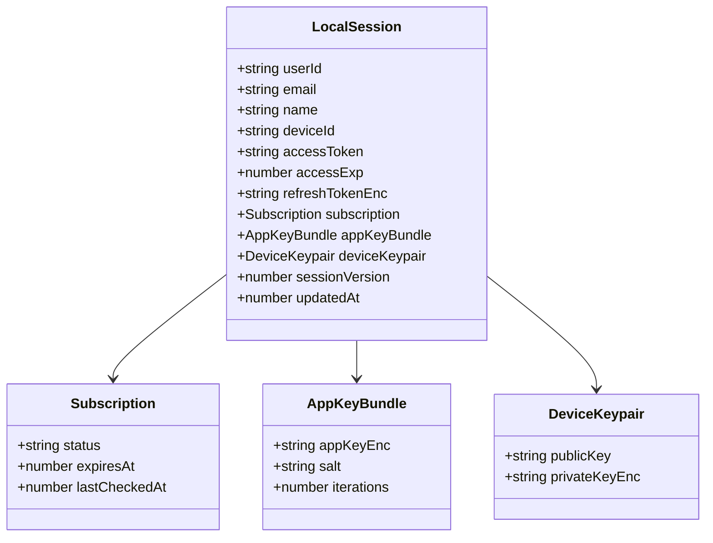

# Diagrams — Auth & Offline Sign‑In

> These are separated for reuse in READMEs or issues. GitHub renders Mermaid.

## Component Architecture
```mermaid
flowchart TB
  subgraph UI["Tauri App (React)"]
    AG[AuthGate]
    UN[UnlockOffline]
    ED[Editor.tsx]
    BC[BookContext.tsx]
  end

  subgraph Core["Local Core"]
    VA[Vault (PBKDF2/HKDF + AES-GCM)]
    LS[LocalSession.enc]
    DK[Device Keypair (privateKeyEnc)]
    DB[(Encrypted Local DB)]
    SW[Sync Worker]
  end

  subgraph Cloud["Backend"]
    AU[Auth API]
    RF[Refresh API]
    SB[Subscription API]
    SR[(Firestore)\nEncrypted Updates]
    DV[Device Registry]
  end

  AG-->UN
  AG-->ED
  ED-->BC
  BC-->DB
  VA-->LS
  VA-->DK
  SW<-->SR
  AG-->AU
  AG-->RF
  AG-->SB
  AG-->DV
```

## First‑Time Login
```mermaid
sequenceDiagram
  autonumber
  participant U as User
  participant App as Tauri App
  participant Auth as /auth/login
  participant Devices as /devices/register
  participant Sub as /auth/subscription

  U->>App: email/password
  App->>Auth: login
  Auth-->>App: token + user
  App->>App: derive AppKey; gen device keypair; encrypt private key
  App->>Devices: register (optional)
  App->>Sub: fetch status (optional)
  App->>App: save LocalSession.enc
```

## Offline Unlock
```mermaid
sequenceDiagram
  autonumber
  participant U as User
  participant App as Tauri App

  U->>App: passcode/password
  App->>App: derive AppKey; decrypt LocalSession
  App->>App: check subscription TTL + grace
  App-->>U: unlock local; sync disabled
```

## Refresh + Online Resume
```mermaid
sequenceDiagram
  autonumber
  participant App as Tauri App
  participant Refresh as /auth/refresh-token
  participant Sub as /auth/subscription

  App->>Refresh: send refreshToken
  Refresh-->>App: access token
  App->>Sub: get subscription
  Sub-->>App: status/expiresAt
  App->>App: save LocalSession; enable sync
```

## Data Model (Class Diagram)

